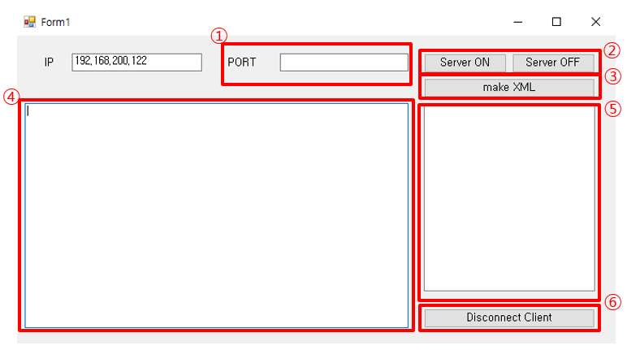
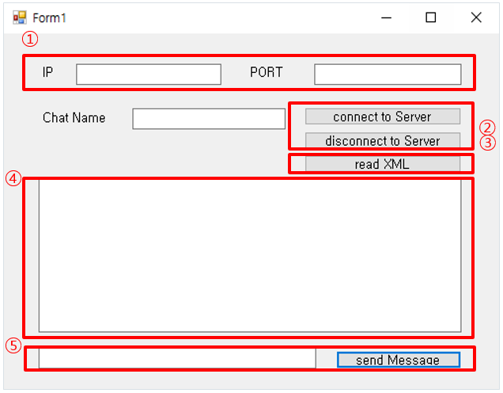
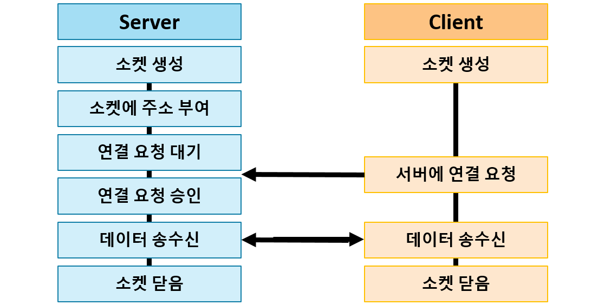
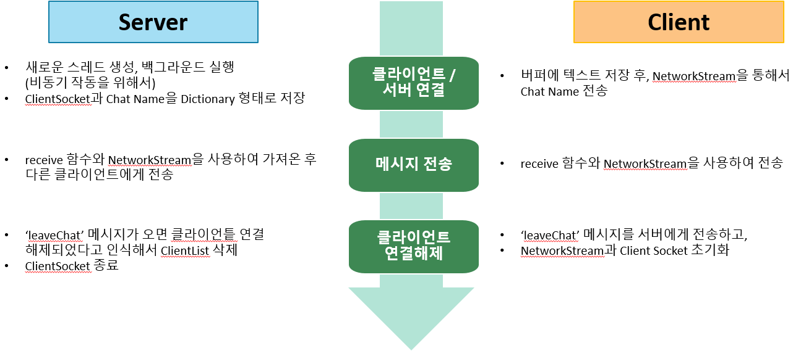

# Chat program using TCP communication
---

## Video
---

1. 1234 port 지정 후 서버 시작
2. 서버 ip, port => xml 파일생성
2. client1 연결 (UI)
3. client2 연결 후 (XML)
4. client1에서 서버와의 접속해제 (다시 메시지 전송이 되지 않음)
5. 서버에서 client2와의 접속해제 (다시 메시지 전송이 되지 않음)
6. client3 다시 서버 연결
7. 서버 종료 후 client 확인

## UI
---
### Server

   

1. 포트 설정 UI
2. 서버 기능 시작/중지 UI
3. XML 파일 만들기 버튼
4. 수신 채팅 내용 표시 UI
5. UI에 표시된 클라이언트를 강제 접속 해제 버튼
6. 현재 연결되어 있는 클라이언트 리스트 표시 UI

### Client

  

1. IP와 포트 입력으로 연결하는 UI
2. 서버 접속/해제 버튼
3. XML로 접속하는 UI
4. 서버로부터 수신한 내용과 채팅 내용을 입력받는 UI
5. 입력한 내용을 접속되어 있는 서버로 송신하는 UI

## Functional requirements
---
### Server
- 지정된 포트로 N개의 클라이언트의 연결 허용
- 서포트 지정방식은 XML 파일에서 읽는 방식과 UI에 입력 받는 2가지 방식 지원
- 서버 기능의 시작/중지할 수 있는 UI 구성
- 클라이언트로부터 수신한 채팅 내용을 현재 연결되어 있는 모든 클라이언트로 전송(채팅 내용을 송신한 클라이언트는 제외)
- 현재 연결되어 있는 클라이언트의 리스트를 UI에 표시
- UI에 표시된 클라이언트를 사용자가 지정하여 강제로 접속 해제 가능

### Client
- 지정된 IP와 포트로 서버에 연결
- IP와 포트 지정 방식은 XML 파일에서 읽는 방식과 UI에 입력 받는 2가지 방식 지원
- 채팅 내용을 입력 받는 UI 구성
- 사용자가 입력한 내용을 접속되어 있는 서버로 송신
- 서버로부터 수신한 내용을 표시하는 UI 구성
- 사용자의 선택에 의해 접속/해제할 수 있는 UI 구성

## Environment
---
- C# Winform

## TCP communication structure
---

 

## Program operation process
---

 

## Limitations
---
- 다양한 예외 상황
  - 서버 시작 시 포트번호가 없을 때 오류
  - 서버 시작 시 다시 시작버튼을 누르면 발생하는 오류
  - 서버가 시작되지 않았을 때 종료 버튼 누르면 오류
  - 서버 종료 시 클라이언트 접속해제
  - 서버 종료 시 클라이언트 무한 대기
  - 서버 종료 시 마지막 연결된 클라이언트만 연결 해제
  - 서버 port 지정이 안되어있는데 XML 파일 만들기
  - 클라이언트 XML 파일이 없을 때, XML 읽기
  - 클라이언트가 서버와 연결중일때 또 연결버튼 누르기 막기
  - 클라이언트가 서버와 연결중일때 또 xml 파일 읽기 막기

- 편의사항
  - 클라이언트 종료시 재연결
  - client 입력에서 Enter 이벤트
  - client, server : port 숫자만 입력 가능하게, 길이제한
  - server : ip 변경 금지
  - client : ip 글자수, 숫자숫자숫자 . 이런형식
  - 채팅 이름 공백 X, 중복 X, 글자수 제한
  - 텍스트박스 입력 금지되게 설정
  - server end 버튼 누르면 메세지
  - 동작 시에 disconnect 버튼 누르면 서버 죽음

## What I've learned
---
- C# Winform Programming
- C# Network Programming(TcpClinet, TcpListener, NetworkStream 객체 사용법)
- 처음에 기능 요구사항만 구현하면 된다고 생각했지만, 실무에서 개발할 때에는 실제 고객이 사용할 것이라고 생각하고 여러가지 예외 상황을 대비하는 법과 편의사항을 추가해서 구현해야 한다는 것을 배웠음
